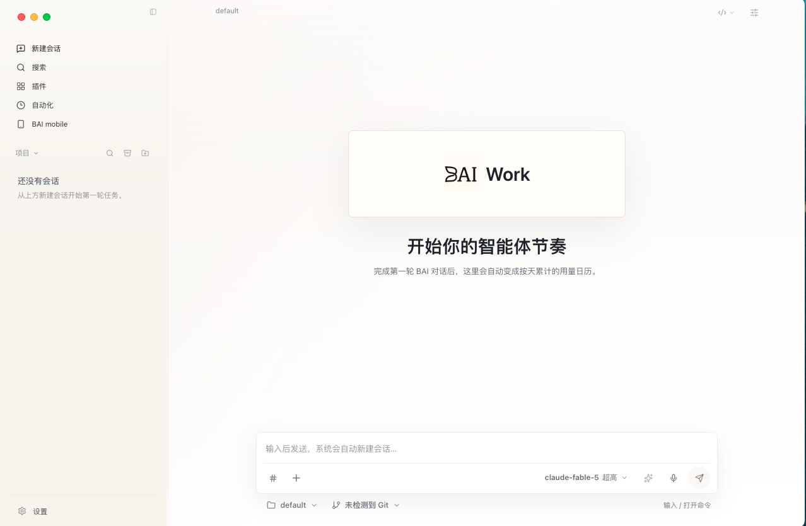

# BAI Work

<p align="center">
  
</p>

BAI Work is a desktop agent workbench built around the BAI Code runtime. It focuses on software engineering tasks such as coding, debugging, architecture design, document generation, planning, reviews, automation, and tool-assisted workflows.

<p align="center">
  
</p>

## Highlights

- **BAI Code core**: packages and invokes the official `baicode` CLI, with a small BAI Work bridge for desktop threads, live progress, estimated usage, and generated artifacts.
- **BAI providers first**: built-in support for the official BAI API plus custom OpenAI-compatible providers.
- **Project workflow**: project-scoped conversations, workspace selection, Git context, file references, side conversations, checkpoints, and review surfaces.
- **Engineering guardrails**: bundled BAI Work guardrails and Hermes-derived skills, an EBAI mapping installer, installable Agent-Reach, and optional external MCP servers.
- **Desktop app**: native Mac Intel, Mac Apple Silicon, and Windows x64 Electron releases with local-only service defaults.

## Quick Start

```bash
npm install
npm run dev
```

Platform release builds:

```bash
npm run dist:mac          # Mac Intel x64 DMG + ZIP
npm run dist:mac:arm64    # Mac Apple Silicon DMG + ZIP
npm run dist:win          # Windows x64 NSIS installer
```

The app stores local preferences and runtime files under the BAI Work application data directory. API keys are treated as credentials and should not be committed.

## Runtime

BAI Work keeps a stable local `/v1/*` desktop boundary for the renderer while forwarding work to the `baicode` CLI and the configured BAI-compatible endpoint. The bridge exposes desktop threads, progress events, and estimated usage without claiming that BAI Code itself publishes those HTTP APIs.

The public BAI Code documentation currently documents the CLI but does not publish a desktop service contract for sessions, event streams, permissions, or questions. BAI Work keeps that compatibility gap explicit. Cache-hit telemetry is shown as unavailable when the runtime does not report it; the app never invents a zero hit rate.

## Project Documents

- [BAI Work technical whitepaper (PDF)](docs/whitepaper/bai-work-whitepaper.pdf)
- [BAI Work technical whitepaper (LaTeX source)](docs/whitepaper/bai-work-whitepaper.tex)
- [BAI Work project presentation (PPTX)](docs/presentation/BAI-Work-Project-Deck.pptx)

## Release

[BAI Work 0.1.0](https://github.com/2830500285/BAI-Work/releases/tag/v0.1.0) is available for all three desktop targets:

| Platform | Download | Runtime packaging |
| --- | --- | --- |
| macOS Intel x64 | [DMG](https://github.com/2830500285/BAI-Work/releases/download/v0.1.0/BAI-Work-0.1.0-mac-x64.dmg) / [ZIP](https://github.com/2830500285/BAI-Work/releases/download/v0.1.0/BAI-Work-0.1.0-mac-x64.zip) | Self-contained BAI Code 0.9.1 runtime |
| macOS Apple Silicon arm64 | [DMG](https://github.com/2830500285/BAI-Work/releases/download/v0.1.0/BAI-Work-0.1.0-mac-arm64.dmg) / [ZIP](https://github.com/2830500285/BAI-Work/releases/download/v0.1.0/BAI-Work-0.1.0-mac-arm64.zip) | Official BAI Code wheelhouse |
| Windows x64 | [NSIS installer](https://github.com/2830500285/BAI-Work/releases/download/v0.1.0/BAI-Work-0.1.0-win-x64.exe) | Official BAI Code wheelhouse |

Apple Silicon and Windows need Python 3.10-3.13 on the target machine. On first use, BAI Work creates a user-local virtual environment and installs BAI Code from the bundled offline wheelhouse. The current macOS builds are ad-hoc signed rather than notarized, and the Windows installer is unsigned.

## Notices

BAI Work is a derivative desktop workbench with a BAI Code-based runtime. Keep upstream notices and license requirements intact when redistributing.
